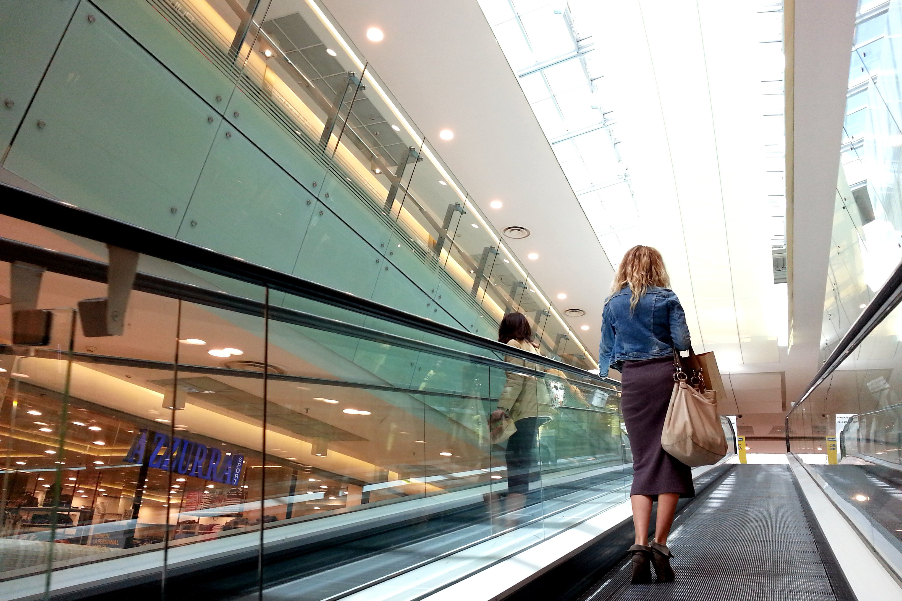
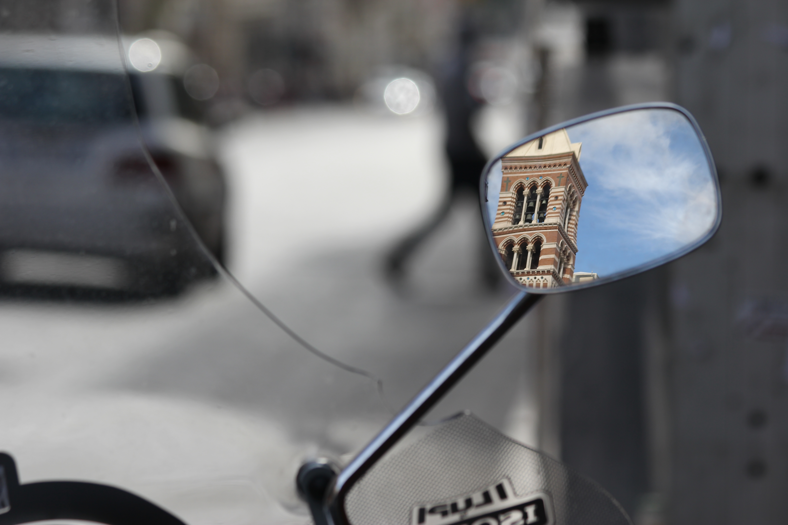

# Sette brevi lezioni di fotografia

## Introduzione
Ho fatto delle foto. Ho fotografato invece di parlare. Ho fotografato per non dimenticare. Per non smettere di guardare. Daniel Pennac
L'importante è divertirsi e trovare il proprio stile.

## Lezione 1 - Comporre con la regola dei terzi

`Penso che la composizione in fotografia sia molto simile al ritmo in musica.
Rodney Smith
`

Pensare idealmente a due linee verticali e due orizontali che dividono l'immagine in parti uguali. Poi sistemare il soggetto all'incrocio o lungo queste linee.

## Lezione 2 - Farsi guidare dalle linee di fuga
Spesso la composizione è davvero il mezzo migliore che un fotografo ha a disposizione per mostrare la complessità della vita; la struttura di un’immagine può suggerire la forma che diviene bellezza. Robert Adams

## Lezione 3 - Riempire il quadro
`
Se la foto non è buona, vuol dire che non eri abbastanza vicino. 
Robert Capa
`

## Lezione 4 - Incorniciare per evidenziare
Usare cornici naturali (come finestre, finestre, specchi, ...) per sottolineare elementi di interesse.
“The picture that you took with your camera is the imagination you want to create with reality.”
— Scott Lorenzo

## Lezione 5 - Ridurre al minimo
`
La cosa più difficile in fotografia è rimanere semplici. 
Anne Geddes
`

## Lezione 6 - Rompere gli schemi
`
Non ci sono regole per una buona foto, ci sono solo buone fotografie. 
Ansel Adams
`

## Lezione 7 - Raccontare una storia
`
Se una foto è buona racconta molte storie diverse. 
Josef Koudelka
`

## Riferimenti

* [9 Photo Composition Tips (feat. Steve McCurry)](https://www.youtube.com/watch?v=7ZVyNjKSr0M)
* 

1 – la regola dei terzi: basta tracciare, idealmente o con l'aiuto della griglia sovrapponibile presente tra le funzioni della macchina, due righe orizzontali e due verticali. L'effetto che si ottiene posizionando il soggetto all'intersezione di due linee, oppure lungo una delle linee è interessante.
Per approfondire: La Regola dei Terzi ;

2 – linee guida: comporre la foto dando importanza alle linee continue presenti nel panorama (ad esempio, binari, cancellate…);

3 – diagonali: movimentare l'immagine inserendo linee diagonali;

4 – cornici naturali: porte, finestre, il finestrino della macchina e altre cornici naturali catturano lo sguardo e sottolineano elementi presenti nella foto;

5 – contrasto tra soggetto e sfondo: giocare con un forte contrasto è un'arte non semplice, che si apprende un po' alla volta, ma che può dare grosse soddisfazioni;

6 – riempire il fotogramma: spesso i principianti sono portati a comprendere tante cose nella composizione anche per via di un qualche timore ad avvicinarsi troppo al soggetto; in questo caso non consideriamo gli altri elementi per riempire il fotogramma con un unico soggetto;

7 – occhio dominante al centro: gli occhi sono elementi fondamentali in un ritratto; qui il consiglio è quello di posizionare l'occhio dominante al centro della foto; l'impressione per chi osserva è quella di essere seguiti dallo sguardo del soggetto immortalato;

8 – elementi ripetuti: schemi, oggetti ricorrenti, strutture ripetitive sono di per se elementi interessanti in una foto; il trucco per andare oltre consiste nel cercare una situazione nella quale lo schema sia in qualche modo interrotto: ad esempio, una selva di ombrelloni rossi con un singolo ombrellone giallo nel mezzo;

9 – simmetria: il cervello umano ama la simmetria (ok, non tutti) o quantomeno ne è attratto; la si può seguire, oppure romperla, comunque anche questo è un terreno sul quale vale la pena di sperimentare.
